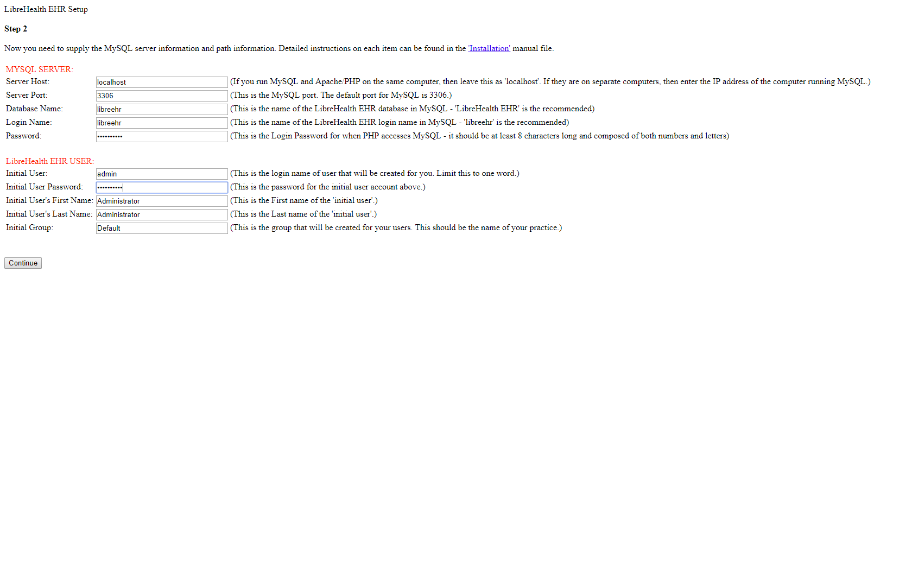
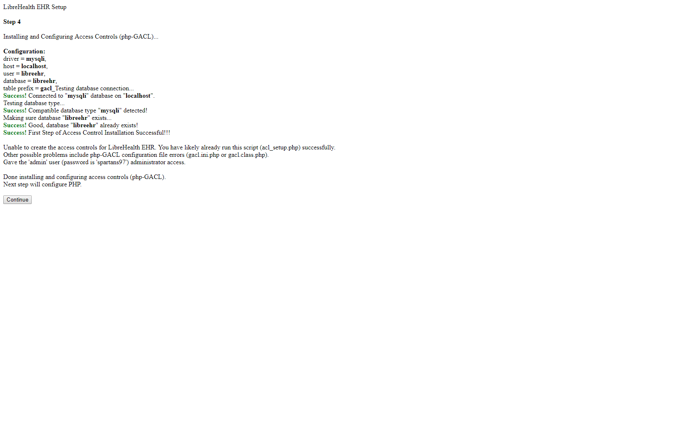
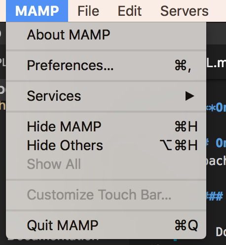
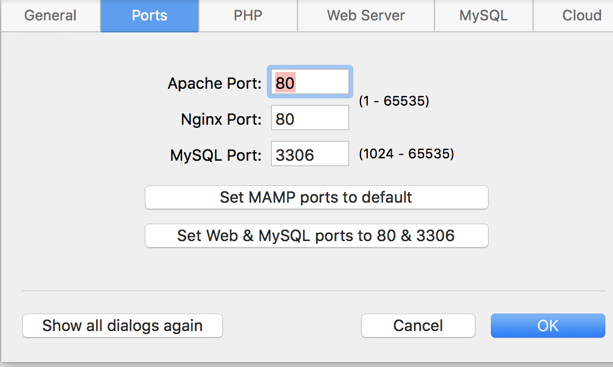
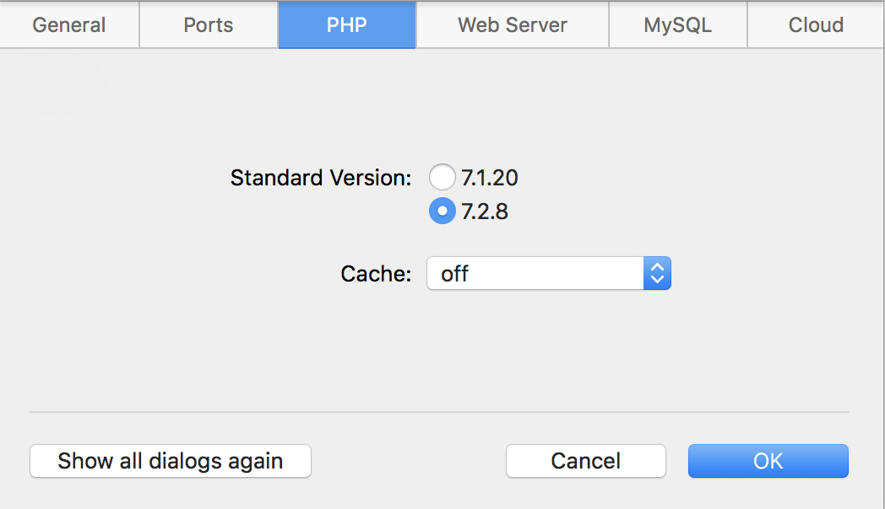
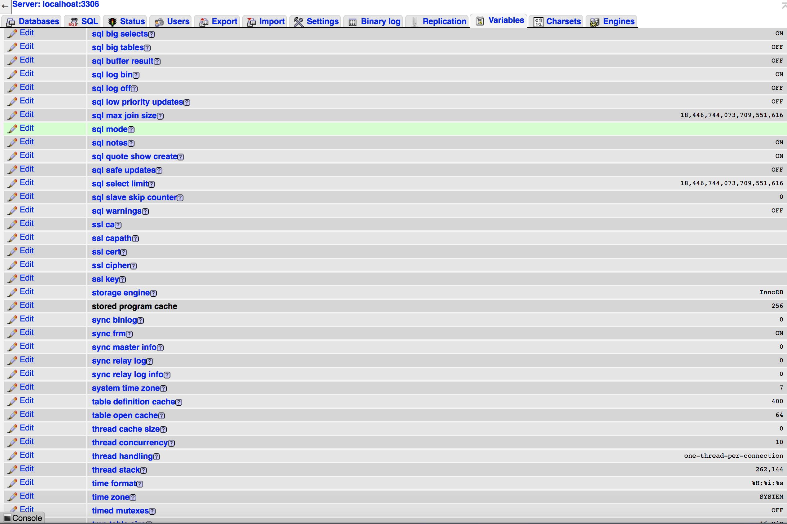

# Installation Instructions
Last Updated: March 28, 2017

### Table of Contents

**[Overview of Directories](#overview-of-directories)**

**[Unpacking](#unpacking)**

**[Setup](#setup)**

**[Setting up Access Control](#setting-up-access-control)**

**[Upgrading](#upgrading)**

**[FAQ](#faq)**

**[Windows Setup](#windows-setup)**

**[Mac Setup With MAMP](#mac-setup-with-mamp)**

##  Overview of Directories

NOTE: Most recent documentation can be found on the online documentation at [LibreHealth](http://librehealth.io/).

contrib: Contains many user-contributed encounter forms and utilities
custom: Contains scripts and other text files commonly customized
Documentation: Contains useful documentation
interface: Contains User Interface scripts and configuration
library: Contains scripts commonly included in other scripts
sql: Contains initial database images
gacl: Contains embedded php-GACL (access controls)

##  Unpacking

The LibreHealthEHR release archive should be named as follows:

`librehealthehr-<version>-release.tar.gz  -or-  librehealthehr-<version>-release.zip`

To extract the archive, use either of the following commands from the command line:

`bash# tar -pxvzf librehealthehr-<version>-release.tar.gz`
`bash# unzip librehealthehr-<version>-release.tar.gz`

Be sure to use the `-p` flag when using tar, as certain permissions must be preserved.

LibreHealthEHR will be extracted into a directory named `librehealthehr`.

Alternatively you can download the source code directly from the repository located at [librehealthehr](https://github.com/LibreHealthIO/librehealthehr) using

```
git clone https://github.com/LibreHealthIO/LibreEHR librehealthehr
```

##  Setup

To run LibreHealthEHR, MariaDB (prefered) or MySQL, and Apache or another PHP-capable webserver must be configured.

If you don't already have it, download and install [Apache](https://apache.org), [MariaDB](https://mariadb.org) (prefered) or [MySQL](https://mysql.com), and [PHP.](https://php.net)

**Note:**

1. PHP versions 7.1+ are not supported.

2. MySQL versions 5.7+ have strict mode enabled by default and must be disabled. Instructions on how to disable it are given in the FAQs section.

3. LibreHealthEHR requires a number of webserver and PHP features which may not be enabled on your system.  These include:
  * PHP Index support (ensure that index.php is in your Index path in httpd.conf)
  * Session variables
  * PHP libcurl support (optional for operation, mandatory for billing)

4. If installing on Linux, make sure these dependencies are met:
```
apache2
mysql-server (or if using mariadb, then use 'mariadb-server' instead)
libapache2-mod-php
libtiff-tools
php
php-mysql
php-cli
php-gd
php-gettext
php-xsl
php-curl
php-mcrypt
php-soap
php-json
imagemagick
php-mbstring
php-zip
php-ldap
php-xml
```

Copy the LibreHealthEHR folder into the root folder of the webserver. On Mandrake Linux, for example, use the command:
  `bash# mv librehealthehr /var/www/html/`

Make sure the webserver is running, and point a web-browser to `setup.php` located within the librehealthehr web folder.  If you installed LibreHealthEHR in the root web directory, the URL would read: `http://localhost/librehealthehr/setup.php`.
The setup script will step you through the configuration of the LibreHealthEHR.

The first screen of the setup script will ensure that the webserver user (in linux, often is `apache`, `www-data`, or `nobody`) has write privileges on certain files and directories.
The files include `librehealthehr/sites/default/sqlconf.php` and `librehealthehr/interface/modules/zend_modules/config/application.config.php`.

In linux, these can be set by `chmod a+w filename` command to grant global write permissions to the file. The directories include:
```
librehealthehr/gacl/admin/templates_c
librehealthehr/sites/default/edi
librehealthehr/sites/default/era
librehealthehr/sites/default/documents
librehealthehr/interface/main/calendar/modules/PostCalendar/pntemplates/compiled
librehealthehr/interface/main/calendar/modules/PostCalendar/pntemplates/cache.
```

**Note:** In linux, if the webserver user name is `apache`, then the command `chown -R apache:apache directory_name` will grant global write permissions to the directories, and we recommend making these changes permanent. Should the page display errors related to file or directory writing priviledges you may click the 'Check Again' button to try again (after fixing permissions).


#### Step 1
You need to tell setup whether it needs to create the database on its own, or if you have already created the database.  MySQL root priveleges will be required to create a database.

#### Step 2
You will be presented with a number of fields which specify the MySQL server details and the `librehealthehr` directory paths.

The `Server Host` field specifies the location of the MySQL server.  If you run MySQL and Apache/PHP on the same server, then leave this as `localhost`. If MySQL and Apache/PHP are on separate servers, then enter the IP address (or host name) of the server running MySQL.

The `Server Port` field specifies the port to use when connecting to the MySQL server over TCP/IP.  This should be left as `3306` unless you changed it in your  MySQL configuration.

The `Database Name` field is the database where LibreHealthEHR will reside.  If you selected to have the database created for you, this database will be created, along with the user specified in `Login Name`.  If this database exists, setup will not be able to create it, and will return an error.  If you selected that you have already created the database, then setup will use the information you provide to connect to the MySQL server.  Note that setup will not accept a password that is not at least one (1) character in length.

The `Login Name` field is the MySQL user that will access the LibreHealthEHR database. If you selected to have the database created for you, this user will be created.  If you selected that you have already created the database, then setup will use the information you provide to connect to the MySQL server.

The `Password` field is the password of the user entered into the above `Login Name` field.  If you selected to have the database created for you, this user and password  will be created.  If you selected that you have already created the database, then setup will use the information you provide to connect to the MySQL server.

The `Name for Root Account` field will only appear if setup is creating the database.  It is the name of the MySQL root account. For localhost, it is usually ok to leave it `root`.

The `Root Pass` field will likewise only appear if setup is creating the database.  It is the password of your existing root user, and is used to acquire the privileges to create the new database and user.

The `User Hostname` field will also only appear if setup is creating the database.  It is the hostname of the Apache/PHP server from which the user, i.e,  `Login Name` is permitted to connect to the MySQL database.  If you are setting up MySQL and Apache/PHP on the same computer, then you can use `localhost`.

The `UTF-8 Collation` field is the collation setting for mysql. If the language you are planning to use in LibreHealthEHR is in the menu, then you can select it. Otherwise, just select `General`. Choosing`None` is not recommended and will force latin1 encoding.

The `Initial User` is the username of the first user, which is what they will use to login.  Limit this to one word only.

The `Initial User Password` is the password of the user entered into the above `Initial User` field.

The `Initial User's First Name` is the value to be used as their first name.  This information may be changed in the user administration page.

The `Initial User's Last Name` is the value to be used as their last name.  This information may be changed in the user administration page.

The `Initial Group` is the first group, basically name of the practice, that will be created.  A user may belong to multiple groups, which again, can be altered on the user administration page. It is suggested that no more than one group per office be used.


#### Step 3
This is where setup will configure LibreHealthEHR.  It will first create the database and connect to it to create the initial tables.  It will then write the mysql database configuration to the `librehealthehr/sites/default/sqlconf.php` file.

Should anything fail during Step 3, you may have to remove the existing database or tables before you can try again. If no errors occur, you will see a `Continue` button at the bottom.


#### Step 4
This step will install and configure the embedded phpGACL access controls.  It will first write configuration settings to files.  It will then configure the database.  It will then give the `Initial User` administrator access.

Should anything fail during Step 4, you may have to remove the existing database or tables before you can try again. If no errors occur, you will see a `Continue` button at the bottom.


#### Step 5
You will be given instructions on configuring the PHP.  We suggest you print these instructions for future reference.  Instructions are given to edit the `php.ini` configuration file.  If possible, the location of your `php.ini` file will be displayed in green.

If your `php.ini` file location is not displayed, then you will need to search for it.  The location of the `php.ini` file is dependent on the operating system.  In linux, `php.ini` is generally found inside the `/etc/php/7.0` directory.  In Windows, the `XAMPP` package places the `php.ini` file in the `xampp\apache\bin\` directory.

To ensure proper functioning of LibreHealthEHR you must make sure that settings in the `php.ini` file include:
```
max_execution_time = 600
max_input_time = 600
max_input_vars = 3000
memory_limit = 512M
post_max_size = 32M
upload_max_filesize = 32M
session.gc_maxlifetime = 14400
short_open_tag = On
display_errors = Off
upload_tmp_dir is set to a correct default value that will work on your system
error_reporting = E_ALL & ~E_DEPRECATED & ~E_STRICT & ~E_NOTICE
```
Make sure that settings in MYSQL /etc/mysql/my.cnf file include:
```
key_buffer_size set to 2% of your system's RAM (Less thatn 2% recommended)
innodb_buffer_pool_size set to 70% of available RAM.
```
Make sure you have disabled strict mode in Mysql .

## How to disable Mysql strict mode?

Make the following changes in the `my.ini/my.cnf`:
Find it here `C:\WAMP\BIN\MYSQL\MySQL Server 5.6\my.ini` OR `C:\xampp\mysql\bin\my.ini`
OR (left click ) wampmanager icon -> MYSQL -> my.ini
In Linux it's typically located in /etc/mysql

    1.  Look for the following line:
    sql-mode = STRICT_TRANS_TABLES,NO_AUTO_CREATE_USER,NO_ENGINE_SUBSTITUTION
    or sometimes it maybe sql_mode

    2.  Change it to:
```
        sql_mode="" (Blank)
```

(XAMPP)
 If you don't find this parameter in the my.ini file, you should run server, open http://localhost/phpmyadmin/, click on the "variables" tab, search for "sql mode", and then set it to:""

In order to take full advantage of the patient documents capability you must make sure that settings in `php.ini` file include `file_uploads = On`, that `upload_max_filesize` is appropriate for your use, and that `upload_tmp_dir` is set to a correct value that will work on your system.

Restart apache service. Instructions on doing that are given in the FAQ section.


#### Step 6
You will be given instructions on configuring the Apache web server.  We suggest you print these instructions for future reference. Instructions are given to secure the`librehealthehrwebroot/sites/*/documents`, `librehealthehrwebroot/sites/*/edi` and `librehealthehrwebroot/sites/*/era` directories, which contain patient information. This can be done be either placing pertinent `.htaccess` files in these directories or by editing the apache configuration file.

The location of the apache configuration file is dependent on the operating system.  In linux, you can type `httpd -V` or `apache2ctle  -V` on the commandline;  the location to the configuration file will be the `HTTPD_ROOT` variable plus the `SERVER_CONFIG_FILE` variable. In Windows, the` XAMPP` package places the configuration file at `xampp\apache\conf\httpd.conf`.

To secure the `/documents`, `/edi` and `/era` directories you can paste following to the end of the apache configuration file (ensure you put full path to directories):
```
<Directory "librehealthehrwebroot">
AllowOverride FileInfo
</Directory>
<Directory "librehealthehrwebroot/sites">
AllowOverride None
</Directory>
<Directory "librehealthehrwebroot/sites/*/documents">
order deny,allow
Deny from all
</Directory>
<Directory "librehealthehrwebroot/sites/*/edi">
order deny,allow
Deny from all
</Directory>
<Directory "librehealthehrwebroot/sites/*/era">
order deny,allow
Deny from all
</Directory>
```


**Note:** If you are running the patient portal these items have to be configured:</br>

[Linux] Enable the `mod_rewrite` module by issuing `a2enmod rewrite` on a terminal.

[Windows] Open apache configuration file and uncomment this line by removing the '#':
```
#LoadModule rewrite_module modules/mod_rewrite.so
```
Search for:
```
AllowOverride None
```
and change it to:
```
AllowOverride All
```

If you are using Wamp, change the following code in your apache configuration file:
```
<Directory "librehealthehrwebroot">
AllowOverride FileInfo
</Directory>
```
to:
```
<Directory "librehealthehrwebroot">
AllowOverride All
</Directory>
```

The final screen includes some additional instructions and important information. We suggest you print these instructions for future reference.

Once the system has been configured properly, you may login.  Connect to the webserver where the files are stored with your web browser.  Login to the system using the username that you picked (default is `admin`), and the password.  From there, select the `Administration` option, and customize the system to your needs.  Add users and groups as is needed. For information on using LibreHealthEHR, consult the User Documentation located in the `Documentation` folder, the documentation at [LibreHealth](http://librehealth.io/).

Reading `librehealthehr/sites/default/config.php` is a good idea.

To create custom encounter forms online documentation at [LibreHealth](http://librehealth.io/). Many forms exist in `interface/forms` and may be used as examples.

General-purpose fax support requires customization within LibreHealthEHR at Administration->Globals and custom/faxcover.txt; it also requires the following utilities:

* faxstat and sendfax from the HylaFAX client package
* mogrify from the ImageMagick package
* tiff2pdf, tiffcp and tiffsplit from the libtiff-tools package
* enscript


##   Setting Up Access Control

phpGACL access controls are installed and configured automatically during LibreHealthEHR setup.  It can be administered within LibreHealthEHR in the admin->acl menu.  This is very powerful access control software.

Learn more about phpGACL [here](http://phpgacl.sourceforge.net/), recommend reading the phpGACL manual, the `/librehealthehr/Documentation/README.phpgacl.md` file, and the online documentation at [LibreHealth](http://librehealth.io/) . Also recommend reading the comments in `/librehealthehr/library/acl.inc`.

##  Upgrading

Be sure to back up your LibreHealthEHR installation and database before upgrading!

Upgrading LibreHealthEHR is currently done by replacing the old `librehealthehr` directory with a newer version. And, ensure you copy your settings from the following old `librehealthehr` files to the new configuration files (we do not recommend simply copying the entire files):

```
librehealthehr/sites/default/sqlconf.php
```

In this `sqlconf.php` file, set  `$config = 1;` (found near bottom of file within bunch of slashes)

The following directories should be copied from the old version to the new version:
```
librehealthehr/sites/default/documents
librehealthehr/sites/default/era
librehealthehr/sites/default/edi
librehealthehr/sites/default/letter_templates
```

If there are other files that you have customized, then you will also need to treat those carefully.

##  Windows Setup

#### Setup
 To run LibreEHR on Windows, [XAMPP](https://sourceforge.net/projects/xampp/files/XAMPP%20Windows/5.6.30/) is needed with a compatible version

 **Note:**

 1. Must have php [7.0](https://sourceforge.net/projects/xampp/files/XAMPP%20Windows/_) or [5.6](https://sourceforge.net/projects/xampp/files/XAMPP%20Windows/) ([5.6.30](https://sourceforge.net/projects/xampp/files/XAMPP%20Windows/5.6.30/) recommended)

 2. php 7.1x is not currently supported

 Clone the LibreEHR [repository](https://github.com/LibreHealthIO/LibreEHR) into your console eg. [GitBash](https://git-for-windows.github.io/), [Cmder](http://cmder.net/)

 After cloning LibreEHR, the `php.ini` file is located in `xampp\php\` directory.

 Open this file with your text editor eg. [Subl](https://www.sublimetext.com/3) or Notepad (which is already installed on your computer).

 There will be 4 php files located in `xampp\php`, but the one needed is the one that's type is "Configuration Settings" that  change the following in the php.ini file:

**Note: You can use the search option (Ctrl+F in some editors) in your text editor to find the specific lines that you need to change accordingly.**
 ```
 max_execution_time = 600
 max_input_time = 600
 max_input_vars = 3000
 memory_limit = 512M
 post_max_size = 32M
 upload_max_filesize = 32M
 session.gc_maxlifetime = 14400
 short_open_tag = On
 display_errors = Off
 upload_tmp_dir is set to a correct default value that will work on your system
 error_reporting = E_ALL & ~E_DEPRECATED & ~E_STRICT & ~E_NOTICE
 ```
 **Remember to save your file, so that your settings don't reset!**

 **Make sure that strict mode is disabled in Mysql**

 **[How to disable Mysql strict mode?](#how-to-disable-mysql-strict-mode-?)**

 #### Step 1
Launch XAMPP Control Panel and navigate to LibreEHR Setup in your browser: `\LibreEHR\setup.php`

 **Note:**
 1. Make sure that your XAMPP control panel has Apache and MySQL turned on
 2. Apache needs to be on port 80, 443 (Try some of the following suggestions on [this forum](https://stackoverflow.com/questions/8103924/xampp-port-80-is-busy-easyphp-error-in-apache-configuration-file) if you are experiencing issues or check out the [FAQs](#faq) on how to contact us)
 3. mySQL needs to be on port 3306

 #### Step 2
 Leave default as the "Site ID:" and press continue.

 

 Make sure that there are no undefined index errors, if so make sure that you changed the php.ini file, or have the correct version of XAMPP.

 

 Then after the second step, continue and leave the option "Have setup create the database" and press continue

 

 For the fourth step, enter a "Password" and "Initial User Password" you are free to change, the "Initial User" to your own username, but for convenience you can also leave it as admin. Then press continue.
**Note:** If you do change your password, or even if you don't, write down your username and password. You will need it for future uses.

 

 Then after the fourth step, you can press continue through the others as long as the steps above were followed with clarity, the rest should have no errors, and each remaining page can be continued without change.

 

 

 

 

 

 

 **Once you see the screen above, you have successfully setup LibreEHR! Congratulations!**

## Mac Setup With MAMP
Apache can be used on Mac to install LibreHealth. However, if you wish to use MAMP, it is also an option.

#### Setup

1. Download [MAMP](https://mamp.info/en/downloads/) version 5.1.

2. After Installation, the directory MAMP can be found in Applications. Go to Applications > MAMP and launch MAMP.app .

 

3. Now navigate to Preferences > Ports and change your Apache Port to 80 and MySQL port to 3306. This can be done by pressing 'Set Web and MySQL ports to 80 & 3306'.

To launch preferences, navigate on the Mac menu bar to MAMP>Preferences

 

 
  
Finally, you should make sure that you have got the right PHP version. (7.2.x Recommended but 7.1.x works fine)

 

4. To make sure the LibreHealthEHR functions properly, you will need to make some changes to your php.ini file. Different versions of php have different php.ini files.
For PHP 7.2.6
`/Applications/MAMP/conf/php7.2.6/php.ini`
For PHP 7.1.20
`/Applications/MAMP/conf/php7.1.20/php.ini`
*NOTE: If you installed MAMP somewhere else, you will have to replace /Applications/MAMP with your location of MAMP*

Make the following changes in your php.ini file to ensure that LibreHealthEHR functions properly:

(Search for the following and make necessary changes)
```
max_execution_time = 600
max_input_time = 600
max_input_vars = 3000
memory_limit = 512M
post_max_size = 32M
upload_max_filesize = 32M
session.gc_maxlifetime = 14400
short_open_tag = On
display_errors = Off
upload_tmp_dir is set to a correct default value that will work on your system
error_reporting = E_ALL & ~E_DEPRECATED & ~E_STRICT & ~E_NOTICE
```

5. Make sure you have disabled strict mode in MySQL.

To make sure that strict mode is disabled in MySQL. Start your MAMP server and go to http://localhost/phpmyadmin/
Go to the Variables heading by navigating through More > Variables. Now find *sql mode* and make sure that it is set to "". To edit the variable, click the edit button next to the name of the variable.
*NOTE: If you are not using port 80, you have go to http://localhost:YOUR_PORT/phpmyadmin/ instead.*

 

6. Start MAMP server

7. Fork the LibreHealthEHR [repository](https://github.com/LibreHealthIO/librehealthehr).

Clone the forked repository to a local directory with:
`git clone https://github.com/your-username/lh-ehr.git` As you are using MAMP, you have to clone the repository to *htdocs* (The files in htdocs will be served in the MAMP server). *htdocs* can be found in.
`YOUR_MAMP_LOCATION/htdocs`

#### Installation
Launch MAMP Control Panel and start your server.

Go to the LibreEHR Setup page in your browser: `localhost/librehealthehr/setup.php` (Make sure that you are on the right port, this can be found in the preference of your MAMP)

 Leave default as the "Site ID:" and press continue.

 

 Make sure that there are no undefined index errors, if so make sure that you changed the php.ini file, or have the correct version PHP installed on your MAMP. (PHP 7.1 and above is not supported)

 

 Then after the second step, continue and leave the option "Have setup create the database" and press continue

 

 For the fourth step, enter a "Password" and "Initial User Password" you are free to change, the "Initial User" to your own username, but for convenience you can also leave it as admin. Also, you will have to change the MySQL port to the one that MAMP is currently using. (You can find this in the preferences of the MAMP Control Panel).

 Then press continue.
**Note:** If you do change your password, or even if you don't, write down your username and password. You will need it for future uses.

 

 Then after the fourth step, you can press continue through the others as long as the steps above were followed with clarity, the rest should have no errors, and each remaining page can be continued without change.

 

 If this comes up, you are set!


## FAQ

**How can I install Apache, MySQL, and PHP on Windows?**

An easy way would be to install the [XAMPP Package](https://www.apachefriends.org/index.html). Make sure to copy the LibreHealthEHR files to the `htdocs` folder.


**Q. How can I install Apache, MySQL, and PHP on Linux?**

Follow the instructions [here](https://www.digitalocean.com/community/tutorials/how-to-install-linux-apache-mysql-php-lamp-stack-on-ubuntu-16-04)


**Q. I'm getting `table doesn't exist` error!**

This is because MySQL versions 5.7 and above have `strict mode` on default which needs to be disabled. This can be done by editing the MySQL configuration file and appending `sql_mode = ERROR_FOR_DIVISION_BY_ZERO,NO_AUTO_CREATE_USER,NO_ENGINE_SUBSTITUTION` at the end (if it is already present, modify it).

In Linux, this file is located in `/etc/mysql/mysql.conf.d/mysqld.cnf`. In Windows, it is usually located in `C:\ProgramData\MySQL\MySQL Server 5.7\my.ini`


**Q. How do I restart the apache service?**

Restart apache service by using `sudo apache2ctl restart` on a terminal for Linux.
For Windows, restart apache service by using the XAMPP control interface, located in system tray (if running) or from `xampp-control.exe` in `C:\xampp`. You can restart apache by navigating to `C:\xampp\apache\bin` using CMD and executing `httpd -k restart`.


**Q. I am getting a Internal Server Error when trying to run portal dashboard!**

To run the patient portal these items have to be configured:

[Linux] Enable the `mod_rewrite` module by issuing `a2enmod rewrite` on a terminal.


[Windows] Open apache configuration file and uncomment this line by removing the '#':
```
#LoadModule rewrite_module modules/mod_rewrite.so
```
Search for:
```
AllowOverride None
```
and change it to:
```
AllowOverride All
```


If you are using Wamp, change the following code in your apache configuration file:
```
<Directory "librehealthehrwebroot">
AllowOverride FileInfo
</Directory>
```
to:
```
<Directory "librehealthehrwebroot">
AllowOverride All
</Directory>
```


**Q. I need help! How do I reach you?**

Feel free to drop by [LibreHealth Chat](https://chat.librehealth.io) or the [LibreHealth Support Forum](https://forums.librehealth.io/c/7-support)!
