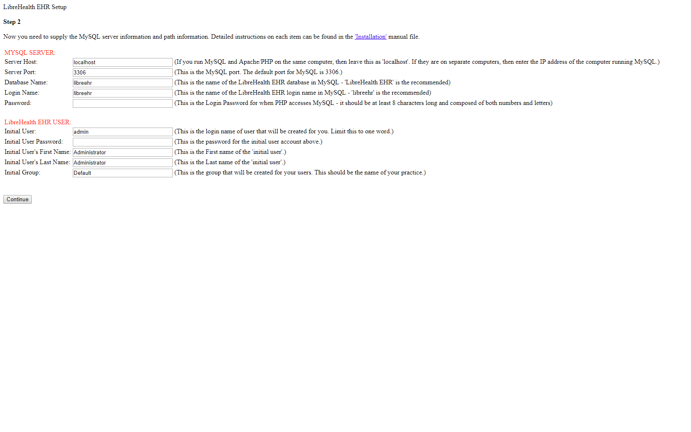
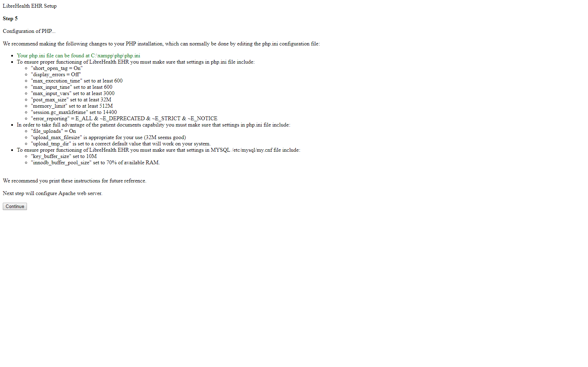
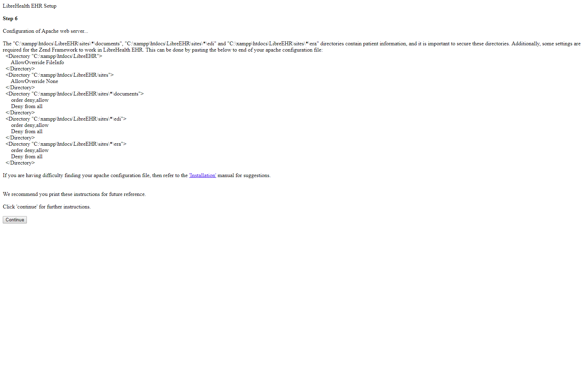

# Installation Instructions
Last Updated: November 16, 2018

### Table of Contents

**[Unpacking](#unpacking)**

**[Windows Setup](#windows-setup)**

**[Non XAMPP Setup](#non-xampp-setup)**

**[Disabling MySQL Strict Mode](#how-do-i-disable-mysql-strict-mode-?)**

**[Setting up Access Control](#setting-up-access-control)**

**[Upgrading](#upgrading)**

**[FAQ](#faq)**

##  Unpacking

Download the source code directly from the repository located at [lh-ehr](https://github.com/LibreHealthIO/lh-ehr) using git bash.

- First fork the repository.

- Then clone the fork.

 ```
 git clone https://github.com/YOURUSERNAME/lh-ehr
 ```

Alternatively, you may download the release archive, which should be named as follows:

`lh-ehr-<version>-release.tar.gz  -or-  lh-ehr-<version>-release.zip`

To extract the archive, use either of the following commands from the command line:

`bash# tar -pxvzf lh-ehr-<version>-release.tar.gz`
`bash# unzip lh-ehr-<version>-release.tar.gz`

Be sure to use the `-p` flag when using tar, as certain permissions must be preserved.

LibreHealthEHR will be extracted into a directory named `lh-ehr`.

##  Windows Setup

#### Requirements

To run LibreHealthEHR on Windows, [XAMPP](https://sourceforge.net/projects/xampp/files/) is needed, which includes the Apache service, MySQL, and PHP. It is recommended to download the latest version (7.2.12). Make sure it is downloaded to 'C:\xampp' directory to give XAMPP full permissions.

#### Steps

1. [Unpack](#unpacking)

2. After unpacking lh-ehr, there is a `php` file with type 'Configuration Settings' located in `xampp\php\` directory. Open this file with your text editor.

3. Change the following in the PHP file using `Ctrl+F`. Some of the variables shown appear multiple times in the file. Do not change any of the values above Line 170 (a blank line).

 ```
 max_execution_time = 600
 max_input_time = 600
 max_input_vars = 3000
 memory_limit = 512M
 post_max_size = 32M
 upload_max_filesize = 32M
 session.gc_maxlifetime = 14400
 short_open_tag = On
 display_errors = Off
 upload_tmp_dir is set to a correct default value that will work on your system
 error_reporting = E_ALL & ~E_DEPRECATED & ~E_STRICT & ~E_NOTICE
 ```

4. Save the file and close it.

5. Make sure that strict mode is disabled in MySQL. Instructions [here](#how-do-i-disable-Mysql-strict-mode-?).

6. Wherever the copy of lh-ehr was created, move it to 'C:\xampp\htdocs'.

7. Launch XAMPP Control Panel. Turn on Apache and MySQL. 'Apache: Port 80,443 ; MySQL: Port 3306'

If you are experiencing errors here, try some of the following suggestions on [this forum](https://stackoverflow.com/questions/8103924/xampp-port-80-is-busy-easyphp-error-in-apache-configuration-file) or the [FAQs](#faq) or contact us.

8. Navigate to the lh-ehr setup.php file in your browser: `localhost/lh-ehr/setup.php`

9. Leave default as the "Site ID:" and press continue.


10. Make sure that there are no undefined index errors, if so make sure that you made the correct changes to the php.ini file, or have the correct version of XAMPP.


11. Click "Have setup create the database" and continue.


12. Enter a "Password" and "Initial User Password" which you should record somewhere for further use. The other details can be changed or left as is.



13. You can press continue through the next few pages as long as the steps above were followed correctly.







**Once you see the screen above, you have successfully setup LibreHealthEHR! Congratulations!**

## Non-XAMPP Setup

#### Requirements
To run LibreHealthEHR, MariaDB (prefered) or MySQL, and Apache or another PHP-capable webserver must be configured.

If you don't already have it, download and install [Apache](https://www.apachelounge.com/download/), [MariaDB](https://downloads.mariadb.org/) (prefered) or [MySQL](https://www.mysql.com/downloads/), and [PHP.](http://php.net/downloads.php)

**Note:**

1. PHP versions must be 7.1 or 7.2.

2. MySQL versions 5.7+ have strict mode enabled by default and must be disabled. Instructions [here](#how-do-i-disable-mysql-strict-mode-?).

3. LibreHealthEHR requires a number of webserver and PHP features which may not be enabled on your system.  These include:
  * PHP Index support (ensure that index.php is in your Index path in httpd.conf)
  * Session variables
  * PHP libcurl support (optional for operation, mandatory for billing)

4. [Linux] Make sure these dependencies are met.
```
apache2
mysql-server (or if using mariadb, then use 'mariadb-server' instead)
libapache2-mod-php
libtiff-tools
php
php-mysql
php-cli
php-gd
php-gettext
php-xsl
php-curl
php-mcrypt
php-soap
php-json
imagemagick
php-mbstring
php-zip
php-ldap
php-xml
```

1. Copy the LibreHealthEHR folder into the root folder of the webserver. On Mandrake Linux, for example, use the command:
  `bash# mv lh-ehr /var/www/html/`

2. Make sure the webserver is running, and point a web-browser to `setup.php` located within the lh-ehr web folder.  If you installed LibreHealthEHR in the root web directory, the URL would read: `http://localhost/lh-ehr/setup.php`.
The setup script will step you through the configuration of the LibreHealthEHR.

3. The first screen of the setup script will ensure that the webserver user (in linux, often is `apache`, `www-data`, or `nobody`) has write privileges on certain files and directories. 
The files include `lh-ehr/sites/default/sqlconf.php` and lh-ehr/interface/modules/zend_modules/config/application.config.php`.

In linux, these can be set by `chmod a+w filename` command to grant global write permissions to the file. The directories include:
```
lh-ehr/gacl/admin/templates_c
lh-ehr/sites/default/edi
lh-ehr/sites/default/era
lh-ehr/sites/default/documents
lh-ehr/interface/main/calendar/modules/PostCalendar/pntemplates/compiled
lh-ehr/interface/main/calendar/modules/PostCalendar/pntemplates/cache.
```

**Note:** In linux, if the webserver user name is `apache`, then the command `chown -R apache:apache directory_name` will grant global write permissions to the directories, and we recommend making these changes permanent. Should the page display errors related to file or directory writing priviledges you may click the 'Check Again' button to try again (after fixing permissions).

4. You need to tell setup whether it needs to create the database on its own, or if you have already created the database.  MySQL root priveleges will be required to create a database.

5. You will be presented with a number of fields which specify the MySQL server details and the `lh-ehr` directory paths.

6. The `Server Host` field specifies the location of the MySQL server. If you run MySQL and Apache/PHP on the same server, then leave this as `localhost`. If MySQL and Apache/PHP are on separate servers, then enter the IP address (or host name) of the server running MySQL.

7. The `Server Port` field specifies the port to use when connecting to the MySQL server over TCP/IP.  This should be left as `3306` unless you changed it in your MySQL configuration.

8. The `Database Name` field is the database where LibreHealthEHR will reside. If you selected to have the database created for you, this database will be created, along with the user specified in `Login Name`. If this database exists, setup will not be able to create it, and will return an error.  If you selected that you have already created the database, then setup will use the information you provide to connect to the MySQL server.  Note that setup will not accept a password that is not at least one (1) character in length.

9. The `Login Name` field is the MySQL user that will access the LibreHealthEHR database. If you selected to have the database created for you, this user will be created. If you selected that you have already created the database, then setup will use the information you provide to connect to the MySQL server.

10. The `Password` field is the password of the user entered into the above `Login Name` field.  If you selected to have the database created for you, this user and password  will be created.  If you selected that you have already created the database, then setup will use the information you provide to connect to the MySQL server.

11. The `Name for Root Account` field will only appear if setup is creating the database. It is the name of the MySQL root account. For localhost, it is usually ok to leave it `root`.

12. The `Root Pass` field will likewise only appear if setup is creating the database. It is the password of your existing root user, and is used to acquire the privileges to create the new database and user.

13. The `User Hostname` field will also only appear if setup is creating the database. It is the hostname of the Apache/PHP server from which the user, i.e, `Login Name` is permitted to connect to the MySQL database.  If you are setting up MySQL and Apache/PHP on the same computer, then you can use `localhost`.

14. The `UTF-8 Collation` field is the collation setting for MySQL. If the language you are planning to use in LibreHealthEHR is in the menu, then you can select it. Otherwise, just select `General`. Choosing`None` is not recommended and will force latin1 encoding.

15. The `Initial User` is the username of the first user, which is what they will use to login. Limit this to one word only.

16. The `Initial User Password` is the password of the user entered into the above `Initial User` field.

17. The `Initial User's First Name` is the value to be used as their first name. This information may be changed in the user administration page.

18. The `Initial User's Last Name` is the value to be used as their last name. This information may be changed in the user administration page.

19. The `Initial Group` is the first group, basically name of the practice, that will be created.  A user may belong to multiple groups, which again, can be altered on the user administration page. It is suggested that no more than one group per office be used.

20. This is where setup will configure LibreHealthEHR.  It will first create the database and connect to it to create the initial tables.  It will then write the MySQL database configuration to the `lh-ehr/sites/default/sqlconf.php` file.

- Should anything fail during Step 3, you may have to remove the existing database or tables before you can try again. If no errors occur, you will see a `Continue` button at the bottom. Click it.

21. This step will install and configure the embedded phpGACL access controls.  It will first write configuration settings to files.  It will then configure the database.  It will then give the `Initial User` administrator access.

- Should anything fail during Step 4, you may have to remove the existing database or tables before you can try again. If no errors occur, you will see a `Continue` button at the bottom. Click it.

22. You will be given instructions on configuring the PHP.  We suggest you print these instructions for future reference. Instructions are given to edit the `php.ini` configuration file. If possible, the location of your `php.ini` file will be displayed in green.

- If your `php.ini` file location is not displayed, then you will need to search for it.  The location of the `php.ini` file is dependent on the operating system.  In linux, `php.ini` is generally found inside the `/etc/php/7.0` directory. In Windows, the `XAMPP` package places the `php.ini` file in the `xampp\apache\bin\` directory.

- To ensure proper functioning of LibreHealthEHR you must make sure that settings in the `php.ini` file include:
```
max_execution_time = 600
max_input_time = 600
max_input_vars = 3000
memory_limit = 512M
post_max_size = 32M
upload_max_filesize = 32M
session.gc_maxlifetime = 14400
short_open_tag = On
display_errors = Off
upload_tmp_dir is set to a correct default value that will work on your system
error_reporting = E_ALL & ~E_DEPRECATED & ~E_STRICT & ~E_NOTICE
```
- Make sure that settings in MySQL/etc/mysql/my.cnf file include:
```
key_buffer_size set to 2% of your system's RAM (Less thatn 2% recommended) 
innodb_buffer_pool_size set to 70% of available RAM.
```
- Make sure you have disabled strict mode in MySQL. Instructions [here](#how-do-i-disable-mysql-strict-mode-?).

23. You will be given instructions on configuring the Apache web server.  We suggest you print these instructions for future reference. Instructions are given to secure the`lh-ehrwebroot/sites/*/documents`, `lh-ehrwebroot/sites/*/edi` and `lh-ehrwebroot/sites/*/era` directories, which contain patient information. This can be done be either placing pertinent `.htaccess` files in these directories or by editing the apache configuration file.

- The location of the apache configuration file is dependent on the operating system.  In linux, you can type `httpd -V` or `apache2ctle  -V` on the commandline;  the location to the configuration file will be the `HTTPD_ROOT` variable plus the `SERVER_CONFIG_FILE` variable. In Windows, the` XAMPP` package places the configuration file at `xampp\apache\conf\httpd.conf`.

- To secure the `/documents`, `/edi` and `/era` directories you can paste following to the end of the apache configuration file (ensure you put full path to directories):
```
<Directory "lh-ehrwebroot">
AllowOverride FileInfo
</Directory>
<Directory "lh-ehrwebroot/sites">
AllowOverride None
</Directory>
<Directory "lh-ehrwebroot/sites/*/documents">
order deny,allow
Deny from all
</Directory>
<Directory "lh-ehrwebroot/sites/*/edi">
order deny,allow
Deny from all
</Directory>
<Directory "lh-ehrwebroot/sites/*/era">
order deny,allow
Deny from all
</Directory>
```

**Note:** 

If you are running the patient portal these items have to be configured:</br>

[Linux] Enable the `mod_rewrite` module by issuing `a2enmod rewrite` on a terminal.

[Windows] Open apache configuration file and uncomment this line by removing the '#':
```
#LoadModule rewrite_module modules/mod_rewrite.so
```
Search for:
```
AllowOverride None
```
and change it to:
```
AllowOverride All
```

If you are using Wamp, change the following code in your apache configuration file:
```
<Directory "lh-ehrwebroot">
AllowOverride FileInfo
</Directory>
```
to:
```
<Directory "lh-ehrwebroot">
AllowOverride All
</Directory>
```

24. The final screen includes some additional instructions and important information. We suggest you print these instructions for future reference.

25. Once the system has been configured properly, you may login.  Connect to the webserver where the files are stored with your web browser.  Login to the system using the username that you picked (default is `admin`), and the password.  From there, select the `Administration` option, and customize the system to your needs.  Add users and groups as is needed. For information on using LibreHealthEHR, consult the User Documentation located in the `Documentation` folder, the documentation at [LibreHealth](http://librehealth.io/).

- Reading `lh-ehr/sites/default/config.php` is a good idea.

- To create custom encounter forms online documentation at [LibreHealth](http://librehealth.io/). Many forms exist in `interface/forms` and may be used as examples.

- General-purpose fax support requires customization within LibreHealthEHR at Administration->Globals and custom/faxcover.txt; it also requires the following utilities:

* faxstat and sendfax from the HylaFAX client package
* mogrify from the ImageMagick package
* tiff2pdf, tiffcp and tiffsplit from the libtiff-tools package
* enscript

## How do I disable MySQL strict mode?

[WAMP]
Make the following changes in the `my.ini/my.cnf`:
Find it here `C:\WAMP\BIN\MYSQL\MySQL Server 5.6\my.ini`
OR (left click) wampmanager icon -> MYSQL -> my.ini
In Linux it's typically located in /etc/mysql

1.  Look for the following line:
 sql-mode = STRICT_TRANS_TABLES,NO_AUTO_CREATE_USER,NO_ENGINE_SUBSTITUTION
 or sometimes it maybe sql_mode

2.  Change it to:
 ```
 sql_mode="" (Blank)
 ```

[XAMPP]
If you don't find this parameter in the my.ini file, you should run server, open http://localhost/phpmyadmin/, click on the "variables" tab, search for "sql mode", and then set it to: "" (Blank).

In order to take full advantage of the patient documents capability you must make sure that settings in `php.ini` file include `file_uploads = On`, that `upload_max_filesize` is appropriate for your use, and that `upload_tmp_dir` is set to a correct value that will work on your system.

Restart apache service. Instructions on doing that are given in the [FAQs](#faq).

##   Setting Up Access Control

phpGACL access controls are installed and configured automatically during LibreHealthEHR setup. It can be administered within LibreHealthEHR in the admin->acl menu. This is very powerful access control software.

Learn more about phpGACL [here](http://phpgacl.sourceforge.net/). It is recommended to read the phpGACL manual, the `/lh-ehr/Documentation/README.phpgacl.md` file, the online documentation at [LibreHealth](http://librehealth.io/), and the comments in `/lh-ehr/library/acl.inc`.

##  Upgrading

Be sure to back up your LibreHealthEHR installation and database before upgrading!

Upgrading LibreHealthEHR is currently done by replacing the old `lh-ehr` directory with a newer version. And, ensure you copy your settings from the following old `lh-ehr` files to the new configuration files (we do not recommend simply copying the entire files):

```
lh-ehr/sites/default/sqlconf.php
```

In this `sqlconf.php` file, set  `$config = 1;` (found near bottom of file within bunch of slashes)

The following directories should be copied from the old version to the new version:
```
lh-ehr/sites/default/documents
lh-ehr/sites/default/era
lh-ehr/sites/default/edi
lh-ehr/sites/default/letter_templates
```

If there are other files that you have customized, then you will also need to treat those carefully.

## FAQ

**How can I install Apache, MySQL, and PHP on Windows?**

An easy way would be to install the [XAMPP Package](https://www.apachefriends.org/index.html). Make sure to copy the lh-ehr files to the `htdocs` folder.

**Q. How can I install Apache, MySQL, and PHP on Linux?**

Follow the instructions [here](https://www.digitalocean.com/community/tutorials/how-to-install-linux-apache-mysql-php-lamp-stack-on-ubuntu-16-04).

**Q. I am getting `table doesn't exist` error!**

This is because MySQL versions 5.7 and above have `strict mode` on default which needs to be disabled. This can be done by editing the MySQL configuration file and appending `sql_mode = ERROR_FOR_DIVISION_BY_ZERO,NO_AUTO_CREATE_USER,NO_ENGINE_SUBSTITUTION` at the end (if it is already present, modify it).

In Linux, this file is located in `/etc/mysql/mysql.conf.d/mysqld.cnf`. In Windows, it is usually located in `C:\ProgramData\MySQL\MySQL Server 5.7\my.ini`

**Q. How do I restart the apache service?**

[Linux] Restart apache service by using `sudo apache2ctl restart` on a terminal.

[Windows] Restart apache service by using the XAMPP control interface, located in system tray (if running) or from `xampp-control.exe` in `C:\xampp`. You can restart apache by navigating to `C:\xampp\apache\bin` using CMD and executing `httpd -k restart`.

**Q. I am getting a Internal Server Error when trying to run portal dashboard!**

To run the patient portal these items have to be configured:

[Linux] Enable the `mod_rewrite` module by issuing `a2enmod rewrite` on a terminal.

[Windows] Open apache configuration file and uncomment this line by removing the '#':
```
#LoadModule rewrite_module modules/mod_rewrite.so
```
Search for:
```
AllowOverride None
```
and change it to:
```
AllowOverride All
```

If you are using WAMP, change the following code in your apache configuration file:
```
<Directory "lh-ehrwebroot">
AllowOverride FileInfo
</Directory>
```
to:
```
<Directory "lh-ehrwebroot">
AllowOverride All
</Directory>
```

**Q. How do I get back to the localhost site once I close out?**

Use the login path with localhost. Ex. (http://localhost/lh-ehr/interface/login/login.php?site=default)

**Q. I need help! How do I contact someone?**

Feel free to drop by the [LibreHealth Chat](https://chat.librehealth.io) or the [LibreHealth Support Forum](https://forums.librehealth.io/c/7-support)!
